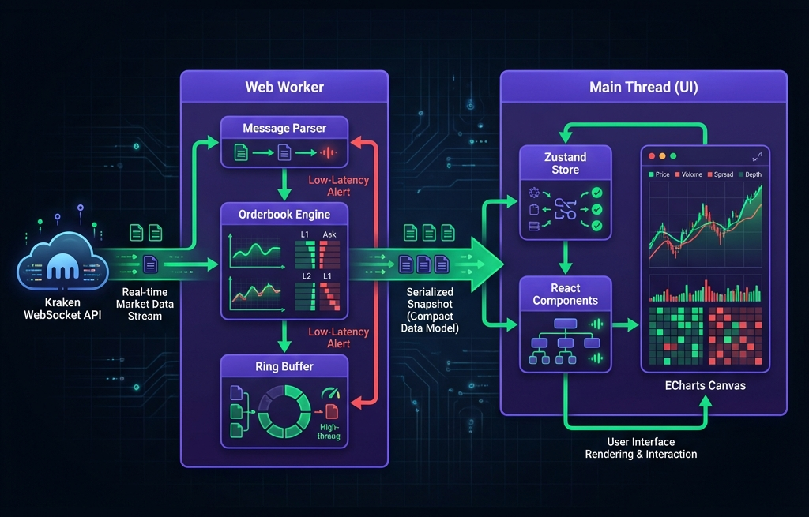

# 🏗 System Architecture & Time Travel Engine

This document outlines the technical design decisions behind the Kraken Orderbook Visualizer, focusing on performance, concurrency, and memory management.

## 🔄 High-Level Data Flow

The system is designed to handle high-frequency WebSocket streams (hundreds of messages/second) without blocking the main UI thread.

## ⚡ Why Use a Web Worker?

Processing high-frequency financial data on the main thread is a common performance pitfall.
- **Problem:** If the main thread is busy calculating orderbook diffs, the UI freezes, scroll stutters, and hover effects lag.
- **Solution:** We offload **100% of data parsing, sorting, and buffering** to a dedicated `orderbook.worker.ts`.
- **Result:** The UI thread only receives "ready-to-render" snapshots. Even during extreme market volatility (e.g., flash crashes), the UI remains responsive at 60fps.

## ⏪ Time Travel & Ring Buffer

Implementing "Time Travel" requires storing historical state. A naive approach (storing an array of all updates) leads to unbounded memory growth and browser crashes.

### The Solution: Circular Ring Buffer
We use a fixed-size Circular Buffer to store recent market snapshots.

1.  **Fixed Capacity:** The buffer holds exactly `N` snapshots (e.g., covering ~60 seconds).
2.  **Overwrite Logic:** When the buffer is full, new snapshots overwrite the oldest ones.
3.  **Memory Stability:** This ensures the application's memory footprint remains constant (flat) regardless of how long it runs.

### Snapshotting vs. Event Replay
We deliberately chose to store **full snapshots** rather than replaying historical delta events.
- **Event Replay Risk:** Replaying thousands of deltas to reach a past state is CPU-intensive and prone to synchronization bugs.
- **Snapshot Reliability:** Storing full states allows instant, O(1) random access to any point in time. When you drag the slider, we simply look up `Buffer[Index]` and render it immediately.

## 📉 Rendering Optimization

- **Throttling:** The worker throttles updates to match the human perception threshold (~10-20ms), preventing unnecessary React re-renders.
- **Canvas Rendering:** We use ECharts (Canvas) instead of SVG. Canvas is significantly faster for charts with thousands of data points (depth charts) that update 60 times a second.
- **React.memo:** All major panels (`OrderBookTable`, `DepthChart`, `TradesPanel`) are memoized. Rows only re-render if data changes.

## 🚀 Performance Targets & Benchmarks

- **Throughput:** Designed to ingest 500+ WebSocket updates/sec without backpressure.
- **Frame Rate:** Maintains stable 60fps on standard hardware (tested on M1/Intel i7).
- **Latency:** Web Worker messaging adds negligible overhead (<5ms) compared to the gains from offloading CPU work.

## 🔮 Future Optimizations (V2)

- **SharedArrayBuffer:** Currently, we serialize objects between threads (structured clone). V2 could use `SharedArrayBuffer` for zero-copy memory sharing.
- **Object Pooling:** To reduce Garbage Collection (GC) pressure during sustained high-volatility, we plan to implement object pooling for orderbook nodes.

